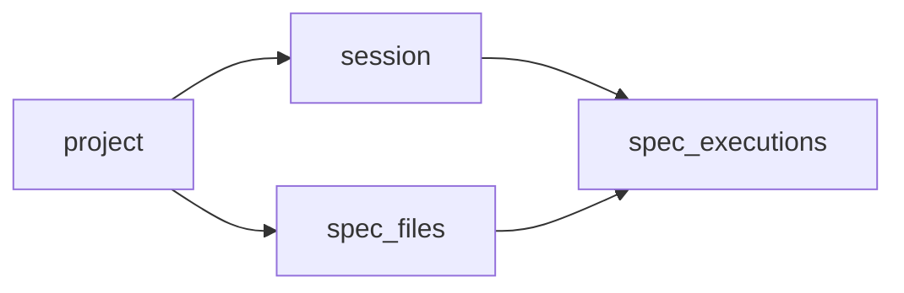

# Receive spec files to run based on previous run

Simple api to grab spec files in order: new specs -> longest specs -> short specs  
Could be used to make concurrent machines that run your tests much equal in duration times

# Version 2

This is `v2` implementation and rational development of ideas implemented in [split-specs v1](https://github.com/Shelex/split-specs)

## Key differences:

- internal restructuring

- due to restructuring it is possible now to properly estimate duration of exact spec file based on previous duration times  
  rather just taking latest sessions which may not include that file.
- use timestamps in milliseconds rather than unix epoch in seconds in order to track durations for quick specs
- rest api instead of graphql (graphql playground is not as convenient as swagger docs) because main gql features are not needed.
- as data has a relational model, switch from `datastore` to `postgres`
- added ws controller for events that could be tracked on UI and give much visibility

## TODO

- dockerize
- deploy

# Use

- [Minimalistic web UI](https://split-specs.appspot.com) along with
  - [Graphql Playground](https://split-specs.appspot.com/playground)
  - [API Endpoint /query](https://split-specs.appspot.com/query)

# Flow

- Register user or login with existing one
- Create new session (it will be attached to existing project or will create new)
- Get nextSpec for your sessionID and machineID, every query will finish previous spec for this session + machine and return next. Final query will return message "session finished" and finish spec and session for specific machineID. in case machineID is not passed it will be "default"

# Try it locally

- clone this repository
- `cd split-specs-v2`
- `make deps` - download dependencies
- `make keys` - generate private and public keys for auth
- `make start` - start the service
- open `http://localhost:3000/swagger` for Swagger documentation
- use `http://localhost:3000/api` for Altair/Postman/Insomnia api clients
- use `http://localhost:3000/` for ui interface

# UI

- `make web-deps` - install dependencies from npm (yarn required)
- `make web-dev` - open ui at localhost for development
- `make web-build` - build page from sources (before deployment)
