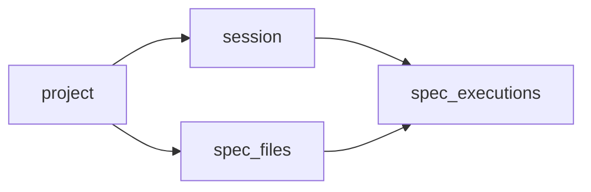

# Receive spec files to run based on previous run

Simple api to grab spec files in order: new specs -> longest specs -> short specs  
Could be used to make concurrent machines that run your tests much equal in duration times

# Use

- [Web UI](https://split-specs.shelex.dev) - for demo purposes you can use email: `test@test.com` password: `test`
- [Swagger](https://split-specs.shelex.dev/swagger) - docs and api playground
- [JS client](https://github.com/Shelex/split-specs-client) - api wrapper and CLI for creating session or running cypress

# Flow

- Register user or login with existing one (for js client library you can create api key).
- Create new session (it will be attached to existing project or will create new)
- Get nextSpec for your sessionID and machineID, every query will finish previous spec for this session + machine and return next. Final query will return message "session finished" and finish spec and session for specific machineID. in case machineID is not passed it will be "default"

# Try it locally
- clone this repository
- `cd split-specs-v2`
- `make deps` - download dependencies
- `make keys` - generate private and public keys for jwt auth
- prepare postgres db, example: `docker run -p 5432:5432/tcp --name postgres-for-split-specs -e POSTGRES_PASSWORD=verysecret -e POSTGRES_DB="split-specs" -d postgres`
- rename `config.env.sample` -> `config.env`
- set `APP_DB_CONNECTION_URL` in `config.env` with your db instance connection string
- `make migration` - run migrations for postgres, first execution will setup db schema
- `make start` - start the service
- `make web-dev` - start ui
- open `http://localhost:3000/swagger` for Swagger documentation
- use `http://localhost:3000/api` for Altair/Postman/Insomnia api clients
- use `http://localhost:3000/` for ui interface
